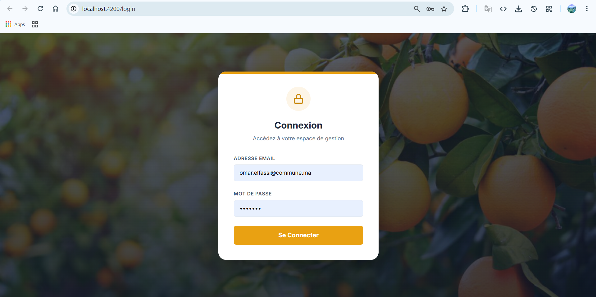
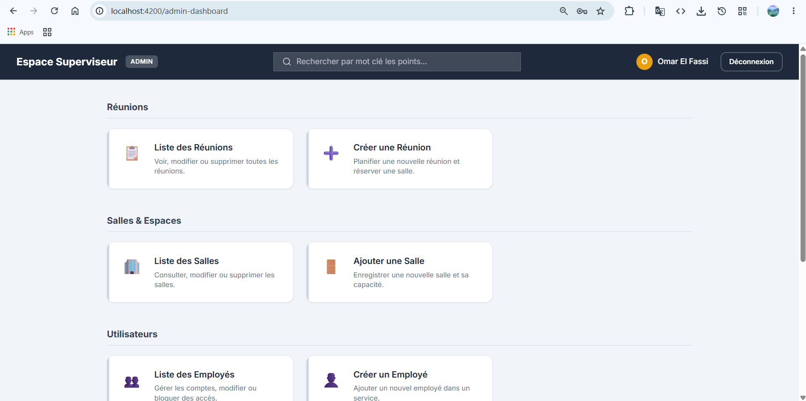
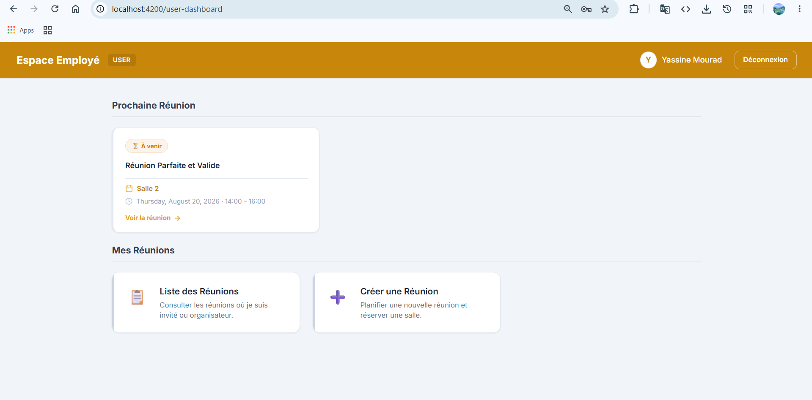
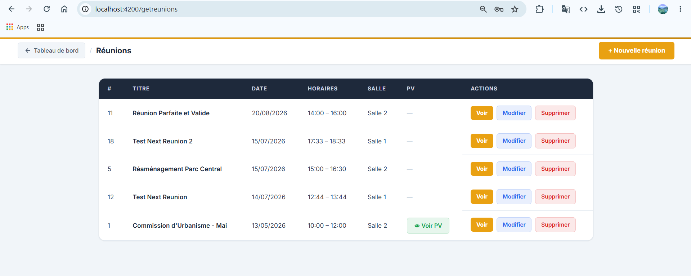
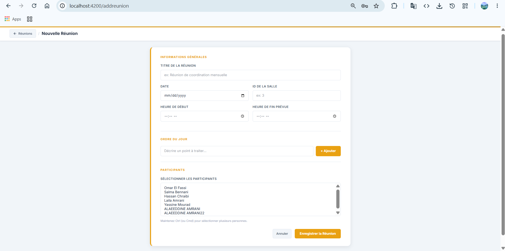
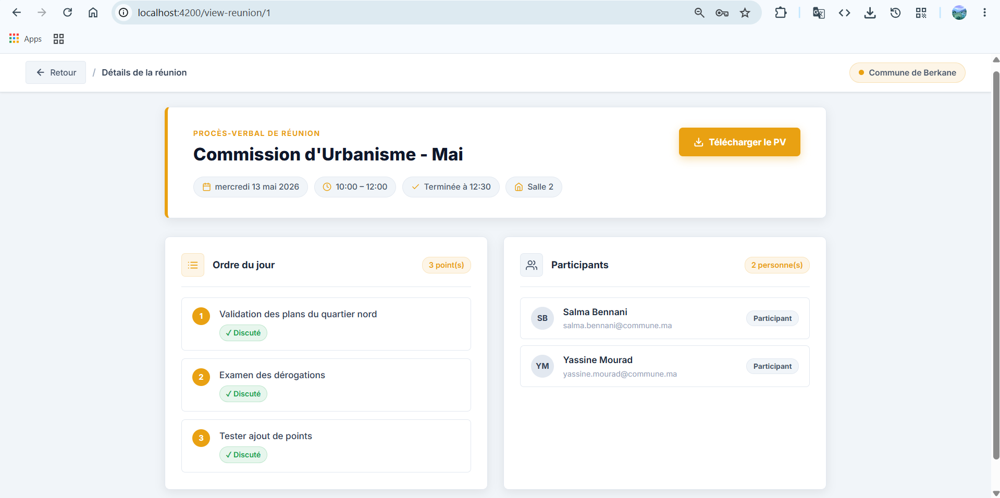
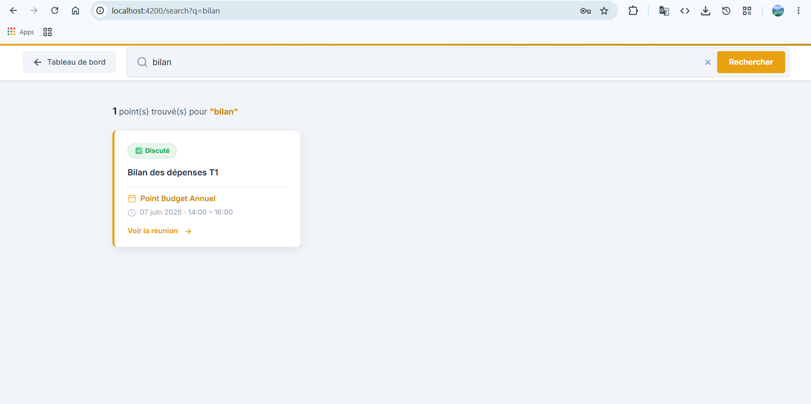
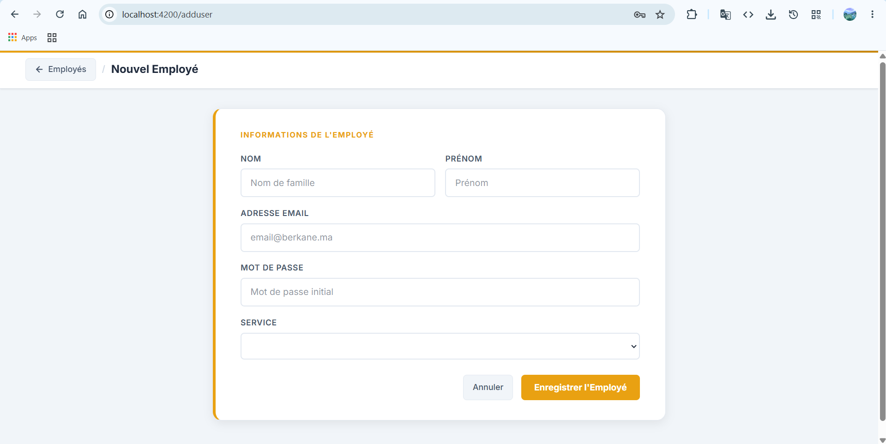
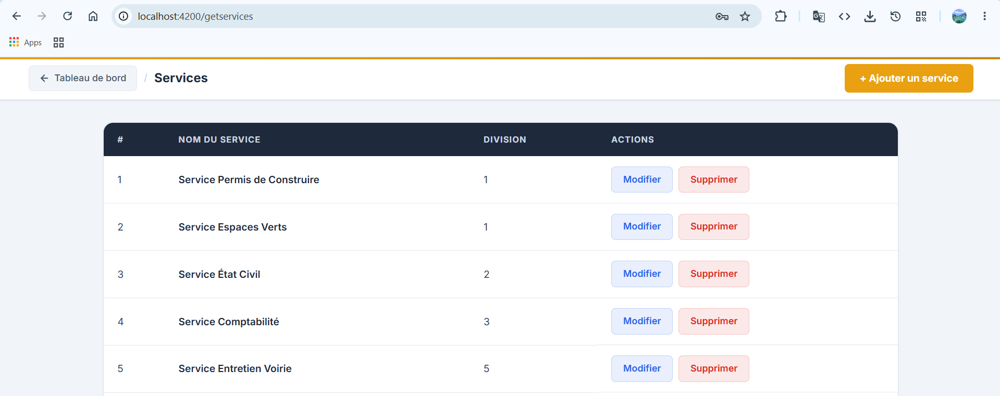

<div align="center">


<br/>


# 📅 Gestionnaire des Réunions

### *Planifiez, Organisez, Suivez — Vos réunions en un clic.*

> Application web full-stack de gestion des réunions internes d'un organisme. Planification, convocation des participants, suivi des ordres du jour, détection des chevauchements et génération de PV — le tout dans une interface moderne et intuitive.

<br/>

[](https://angular.dev/)
[](https://nodejs.org/)
[](https://expressjs.com/)
[](https://www.mysql.com/)
[](https://material.angular.io/)
[](https://tailwindcss.com/)
[](https://jwt.io/)

<br/>

```
📅 Réunions gérées   •   👥 Participants convoqués   •   🏢 Salles & Services organisés
```

</div>

---

## 📋 Table of Contents

- [About The Project](#-about-the-project)
- [Platform Preview](#%EF%B8%8F-platform-preview)
  - [🔐 Login Page](#-login-page)
  - [📊 Admin Dashboard](#-admin-dashboard)
  - [👤 User Dashboard](#-user-dashboard)
  - [📅 Reunion List & Management](#-reunion-list--management)
  - [➕ Create / Edit Reunion](#-create--edit-reunion)
  - [👁️ View Reunion Details](#%EF%B8%8F-view-reunion-details)
  - [🔍 Search Page](#-search-page)
  - [👥 User Management](#-user-management)
  - [🏢 Services, Divisions & Salles](#-services-divisions--salles)
- [Key Features](#-key-features)
- [Tech Stack](#%EF%B8%8F-tech-stack)
- [Architecture](#-architecture)
- [Database Schema](#-database-schema)
- [Getting Started](#-getting-started)
- [API Reference](#-api-reference)
- [Contributing](#-contributing)
- [Authors](#-authors)

---

## 🔭 About The Project

**Gestionnaire des Réunions** is a full-stack web application developed during an **INE1** (Ingénieur d'État 1ère année) internship at the **Commune de Berkane**, as part of the curriculum at **INPT** (Institut National des Postes et Télécommunications), Rabat, Morocco. It provides a complete meeting management solution for the commune, covering the entire lifecycle of a meeting — from scheduling and participant invitation to agenda tracking and report generation.

The application addresses key organizational challenges:

- 🔍 **Overlap Detection** — prevents scheduling conflicts for both rooms and participants
- 📋 **Agenda Management** — create, edit, and track discussion points (*points de l'ordre du jour*) per meeting
- 👥 **Internal & External Participants** — manage both employees and external guests from different organizations
- 📄 **PV / Report Upload** — attach meeting minutes (Procès-Verbal) as file uploads
- 🔐 **Role-Based Access Control** — Admin and User roles with JWT-protected routes
- 🏢 **Organizational Hierarchy** — Divisions → Services → Users structure mirroring real institutions

---

## 🖼️ Platform Preview

### 🔐 Login Page

> *The authentication page provides JWT-based login. Users are redirected to their role-specific dashboard (Admin or User) upon successful authentication.*

<!-- Replace with actual screenshot -->


**Features:**
- Email + Password authentication
- JWT token generation and storage
- Role-based redirection (Admin → Admin Dashboard, User → User Dashboard)
- Token expiration handling with auto-logout

```
┌─────────────────────────────────────────┐
│          📅 Gestionnaire des Réunions   │
│                                         │
│     ┌──────────────────────────┐        │
│     │  📧 Email                │        │
│     └──────────────────────────┘        │
│     ┌──────────────────────────┐        │
│     │  🔒 Mot de passe         │        │
│     └──────────────────────────┘        │
│                                         │
│         [ Se connecter ]                │
└─────────────────────────────────────────┘
```

---

### 📊 Admin Dashboard

> *The admin dashboard provides a central hub for managing all aspects of the application: users, rooms, services, divisions, and meetings.*



**Admin capabilities:**
- Full CRUD on all entities (Utilisateurs, Salles, Services, Divisions)
- View all meetings across the organization
- Manage organizational structure (Divisions → Services)
- Add/edit/delete meeting rooms with capacity tracking

---

### 👤 User Dashboard

> *The user dashboard provides a personal view of meetings, upcoming events, and quick access to meeting creation.*



**User capabilities:**
- View personal meetings (as organizer or participant)
- See the next upcoming meeting at a glance
- Quick access to create new meetings
- Browse and search through meeting agendas

---

### 📅 Reunion List & Management

> *A comprehensive list of all meetings with key information: title, date, time slots, assigned room, and PV status.*



**List features:**
- Tabular display with title, date, start/end times, room assignment
- PV indicator (attached ✅ / not attached ❌)
- Edit and delete actions per row
- Role-based filtering (users see only their meetings)

```
┌──────────────────────────────────────────────────────────────────────┐
│  Titre          │ Date       │ Début │ Fin    │ Salle    │ PV │ ⚙️  │
├──────────────────────────────────────────────────────────────────────┤
│  Réunion RH     │ 2026-07-20 │ 09:00 │ 10:30  │ Salle A  │ ✅ │ ✏️🗑│
│  Comité budget  │ 2026-07-21 │ 14:00 │ 16:00  │ Salle B  │ ❌ │ ✏️🗑│
│  Point projet X │ 2026-07-22 │ 10:00 │ 11:00  │ Salle C  │ ❌ │ ✏️🗑│
└──────────────────────────────────────────────────────────────────────┘
```

---

### ➕ Create / Edit Reunion

> *A rich form for creating or editing meetings, with participant selection, time slot configuration, room assignment, agenda items management, and PV file upload.*



**Form features:**
- Title, date, start time, estimated end time, actual end time
- Room selection dropdown (linked to `salle` table)
- Multi-select participant picker from internal users
- Dynamic agenda points (*points de l'ordre du jour*) — add/remove items
- Mark points as "discussed" or "not discussed"
- **Overlap detection** — real-time check before saving:
  - ⚠️ Room already booked at that time slot
  - ⚠️ Participant already convened in another meeting

---

### 👁️ View Reunion Details

> *A detailed read-only view of a meeting, showing all associated data: participants with roles, agenda points with discussion status, and attached PV document.*



**Detail sections:**
- Meeting metadata (title, date, times, room)
- Participant list with roles (ORGANISATEUR / PARTICIPANT)
- Agenda points with est_discuté status
- PV download link (if attached)

---

### 🔍 Search Page

> *A keyword-based search engine that queries agenda point descriptions across all meetings, allowing users to quickly find relevant discussions and navigate to their parent meeting.*



**Search capabilities:**
- Multi-keyword search across `point.description`
- Results show matched agenda points with their parent meeting
- Click-through to the full meeting details view
- Results sorted by date (most recent first)

```
🔍 "budget prévisionnel"

  📄 Point: "Discussion du budget prévisionnel 2027"
     └── 📅 Réunion: Comité financier — 2026-07-15

  📄 Point: "Validation budget prévisionnel département IT"
     └── 📅 Réunion: Revue trimestrielle — 2026-06-20
```

---

### 👥 User Management

> *Admin-only interface for managing users: create accounts, link to a service, and manage credentials.*



**User fields:** Nom, Prénom, Email, Mot de passe (bcrypt-hashed), Service

---

### 🏢 Services, Divisions & Salles

> *Admin-only CRUD interfaces for managing the organizational hierarchy (Divisions → Services) and meeting rooms (Salles) with capacity information.*



**Organizational hierarchy:**

```
🏛️ Division
 └── 📂 Service
      └── 👤 Utilisateur

Example:
 🏛️ Direction Générale
  ├── 📂 Service Financier
  │    ├── 👤 Ahmed (Admin)
  │    └── 👤 Fatima (User)
  └── 📂 Service RH
       └── 👤 Youssef (User)
```

**Salle management:**
- Room name (unique constraint)
- Capacity tracking
- Used in reunion scheduling and overlap detection

---

## ✨ Key Features

| Feature | Description |
|---|---|
| 🔐 **JWT Authentication** | Secure login with token-based auth, role extraction from payload, and auto-expiration handling |
| 👥 **Role-Based Access** | Admin guard + Auth guard — Admins manage everything, Users manage only their meetings |
| 📅 **Full Meeting CRUD** | Create, read, update, delete meetings with transactional integrity (points + participants) |
| ⚠️ **Overlap Detection** | Real-time check for room and participant scheduling conflicts before saving |
| 📋 **Agenda Management** | Dynamic order-of-day points — add, edit, mark as discussed, delete |
| 📄 **PV Upload** | Multer-based file upload for meeting minutes (Procès-Verbal) |
| 🔍 **Keyword Search** | Search through agenda point descriptions across all meetings |
| 🏢 **Org Structure** | Full hierarchy management: Divisions → Services → Users |
| 🏠 **Meeting Rooms** | Room management with capacity and unique name constraints |
| 👤 **My Meetings** | Users see only meetings where they are organizer or participant |
| ⏭️ **Next Meeting** | Quick view of the user's closest upcoming meeting |
| 🔒 **Password Hashing** | bcrypt-based password hashing with migration script for existing users |

---

## 🛠️ Tech Stack

### Frontend

| Technology | Version | Role |
|---|---|---|
| **Angular** | 21.2 | Core SPA framework — components, signals, routing, SSR-ready |
| **Angular Material** | 21.2 | UI component library — forms, tables, dialogs, buttons |
| **Angular CDK** | 21.2 | Component Development Kit — overlays, drag-and-drop |
| **TailwindCSS** | 4.1 | Utility-first CSS framework for rapid styling |
| **TypeScript** | 5.9 | Type-safe JavaScript superset |
| **RxJS** | 7.8 | Reactive programming — HTTP calls, state management |
| **Vite** | (via Angular CLI) | Fast dev server and build toolchain |

### Backend

| Technology | Version | Role |
|---|---|---|
| **Node.js** | LTS | Server-side JavaScript runtime |
| **Express.js** | 5.1 | REST API framework — routing, middleware chain |
| **mysql2** | latest | MySQL driver with connection pooling (10 connections) |
| **jsonwebtoken** | latest | JWT generation and verification |
| **bcryptjs** | latest | Password hashing (salt rounds) |
| **multer** | latest | File upload middleware (PV/report documents) |
| **dotenv** | latest | Environment variable management |
| **cors** | latest | Cross-Origin Resource Sharing middleware |

### Database

| Technology | Role |
|---|---|
| **MySQL 9.4** | Relational database — 10 tables, foreign keys, transactions |

---

## 🏗️ Architecture

```
┌───────────────────────────────────────────────────────────────────┐
│                    User Browser (Angular SPA)                     │
│                                                                   │
│  AuthComponent  AdminDashboard  UserDashboard  ReunionList  ...   │
│       │              │               │              │             │
│       └──────────────┴───────────────┴──────────────┘             │
│                              │                                    │
│              ┌───────────────┴──────────────────┐                 │
│              │     Angular HttpClient (RxJS)    │                 │
│              │   + JWT Interceptor (Bearer)     │                 │
│              └───────────────┬──────────────────┘                 │
└──────────────────────────────┼────────────────────────────────────┘
                               │
                    Authorization: Bearer <token>
                               │
                               ▼
                  ┌─────────────────────────┐
                  │   Express.js Backend    │
                  │   (Node.js :3000)       │
                  │                         │
                  │   ┌───────────────────┐ │
                  │   │  authMiddleware   │ │ ← JWT verify
                  │   │  (req.user)       │ │
                  │   └────────┬──────────┘ │
                  │            │            │
                  │   ┌────────▼──────────┐ │
                  │   │   Controllers     │ │
                  │   │  (6 controllers)  │ │
                  │   └────────┬──────────┘ │
                  │            │            │
                  │   ┌────────▼──────────┐ │
                  │   │     Models        │ │
                  │   │  (6 models)       │ │
                  │   └────────┬──────────┘ │
                  └────────────┼────────────┘
                               │
                               ▼
                    ┌──────────────────────┐
                    │   MySQL Database     │
                    │   (gestreunion)      │
                    │                      │
                    │   10 tables:         │
                    │   - reunion          │
                    │   - utilisateur      │
                    │   - salle            │
                    │   - service          │
                    │   - division         │
                    │   - point            │
                    │   - convoquer_interne│
                    │   - convoquer_externe│
                    │   - personneexterne  │
                    │   - organisme        │
                    └──────────────────────┘
```

### Project Structure

```
Gestionnaire-des-Réunions/
├── client/                          # Angular 21 SPA
│   ├── src/
│   │   ├── app/
│   │   │   ├── auth/                # Login component
│   │   │   ├── admin-dashboard/     # Admin home page
│   │   │   ├── user-dashboard/      # User home page
│   │   │   ├── add-reunion/         # Create meeting form
│   │   │   ├── edit-reunion/        # Edit meeting form
│   │   │   ├── view-reunion/        # Meeting detail view
│   │   │   ├── reunion-list/        # Meetings table
│   │   │   ├── search-page/         # Keyword search
│   │   │   ├── add-user/            # Create user (admin)
│   │   │   ├── edit-user/           # Edit user (admin)
│   │   │   ├── user-list/           # Users table (admin)
│   │   │   ├── add-salle/           # Create room (admin)
│   │   │   ├── edit-salle/          # Edit room (admin)
│   │   │   ├── salle-list/          # Rooms table (admin)
│   │   │   ├── add-service/         # Create service (admin)
│   │   │   ├── edit-service/        # Edit service (admin)
│   │   │   ├── service-list/        # Services table (admin)
│   │   │   ├── add-division/        # Create division (admin)
│   │   │   ├── edit-division/       # Edit division (admin)
│   │   │   ├── division-list/       # Divisions table (admin)
│   │   │   ├── guards/              # authGuard + adminGuard
│   │   │   ├── interceptors/        # JWT token interceptor
│   │   │   ├── services/            # Angular HTTP services (5)
│   │   │   ├── app.routes.ts        # 20+ routes with guards
│   │   │   └── app.ts              # Root component
│   │   ├── assets/
│   │   └── styles.css
│   ├── angular.json
│   └── package.json
├── server/                          # Node.js + Express API
│   ├── config/
│   │   └── db.js                   # MySQL pool (10 connections)
│   ├── controllers/                 # 6 controllers
│   │   ├── AuthController.js
│   │   ├── ReunionController.js     # 18KB — most complex
│   │   ├── UtilisateurController.js
│   │   ├── SalleController.js
│   │   ├── ServiceController.js
│   │   └── DivisionController.js
│   ├── models/                      # 6 models (raw SQL)
│   │   ├── AuthModel.js
│   │   ├── ReunionModel.js          # 19KB — transactions, joins
│   │   ├── UtilisateurModel.js
│   │   ├── SalleModel.js
│   │   ├── ServiceModel.js
│   │   └── DivisionModel.js
│   ├── routes/                      # 6 route files
│   ├── middlewares/
│   │   ├── authMiddleware.js        # JWT verification
│   │   └── upload.js                # Multer file upload
│   ├── scripts/
│   │   └── hashExistingPasswords.js # Migration: plaintext → bcrypt
│   ├── uploads/                     # PV file storage
│   ├── app.js                       # Express entry point
│   └── .env                         # Environment variables
├── database/
│   └── gestreunion_dump.sql         # MySQL schema dump (10 tables)
├── screenshots/                     # App screenshots (add here)
└── README.md
```

---

## 🗄️ Database Schema

The application uses a **MySQL** relational database with **10 tables** organized around an organizational structure and meeting management logic.

### Entity-Relationship Diagram

```
┌────────────────┐        ┌────────────────┐
│   division     │        │   organisme    │
│────────────────│        │────────────────│
│ id_division PK │        │ id_organisme PK│
│ nom_division   │        │ nom_organisme  │
└───────┬────────┘        └───────┬────────┘
        │ 1:N                     │ 1:N
        ▼                         ▼
┌────────────────┐        ┌──────────────────┐
│   service      │        │ personneexterne  │
│────────────────│        │──────────────────│
│ id_service  PK │        │ id_personne   PK │
│ nom_service    │        │ nom_complet      │
│ id_division FK │        │ email            │
└───────┬────────┘        │ id_organisme  FK │
        │ 1:N             └───────┬──────────┘
        ▼                         │
┌────────────────┐                │
│  utilisateur   │                │
│────────────────│                │
│ id_utilisateur │                │
│ nom, prenom    │                │
│ email          │                │
│ mot_de_passe   │    ┌───────────┴──────────┐
│ role (enum)    │    │ convoquer_externe    │
│ id_service  FK │    │──────────────────────│
└───────┬────────┘    │ id_reunion  FK (PK)  │
        │             │ id_personne FK (PK)  │
        │             └───────────┬──────────┘
        │                         │
┌───────┴──────────────┐          │
│ convoquer_interne    │          │
│──────────────────────│          │
│ id_utilisateur FK(PK)│    ┌─────┴───────────┐
│ id_reunion     FK(PK)│    │    reunion      │
│ role_reunion (enum)  │───►│─────────────────│
│  ORGANISATEUR /      │    │ id_reunion  PK  │
│  PARTICIPANT         │    │ titre           │
└──────────────────────┘    │ date_reunion    │
                            │ heure_debut     │
                            │ heure_fin_prevue│
                            │ heure_fin_reelle│
                            │ id_salle    FK  │───►┌──────────────┐
                            │ pv_rapport BLOB │    │    salle     │
                            └───────┬─────────┘    │──────────────│
                                    │ 1:N          │ id_salle  PK │
                                    ▼              │ nom_salle UQ │
                            ┌────────────────┐     │ capacite     │
                            │     point      │     └──────────────┘
                            │────────────────│
                            │ id_point    PK │
                            │ description    │
                            │ est_discute    │
                            │ id_reunion  FK │
                            └────────────────┘
```

### Tables Summary

| Table | Description | Key Relationships |
|---|---|---|
| `reunion` | Core meeting entity | → salle (FK), ← point (1:N), ← convoquer_interne (N:M) |
| `utilisateur` | Internal users/employees | → service (FK), ← convoquer_interne (N:M with reunion) |
| `salle` | Meeting rooms | ← reunion (1:N) |
| `point` | Agenda items | → reunion (FK) |
| `convoquer_interne` | Internal participant convocations | → reunion (FK), → utilisateur (FK), role enum |
| `convoquer_externe` | External participant convocations | → reunion (FK), → personneexterne (FK) |
| `personneexterne` | External guests | → organisme (FK) |
| `organisme` | External organizations | ← personneexterne (1:N) |
| `service` | Organizational services | → division (FK), ← utilisateur (1:N) |
| `division` | Top-level divisions | ← service (1:N) |

---

## 🚀 Getting Started

### Prerequisites

- **Node.js** v18+ installed
- **MySQL** 8.0+ running locally (or MySQL 9.4 as used in development)
- **Angular CLI** v21+ (`npm install -g @angular/cli`)

### Installation

**1. Clone the repository**

```bash
git clone https://github.com/AlaeeddineAmrani/Gestionnaire-des-Reunions.git
cd Gestionnaire-des-Reunions
```

**2. Set up the database**

Import the SQL dump into your MySQL server:

```bash
mysql -u root -p < database/gestreunion_dump.sql
```

Or import `database/gestreunion_dump.sql` via MySQL Workbench (Server → Data Import).

**3. Configure environment variables**

Create a `.env` file in the `server/` directory:

```env
DB_HOST=localhost
DB_USER=root
DB_PASSWORD=your_mysql_password
DB_NAME=GestReunion

JWT_SECRET=your_super_secret_jwt_key
```

**4. Install backend dependencies**

```bash
cd server
npm install
```

**5. Install frontend dependencies**

```bash
cd ../client
npm install
```

**6. Hash existing passwords** *(if importing data with plain-text passwords)*

```bash
cd ../server
node scripts/hashExistingPasswords.js
```

**7. Start the application**

Backend (port 3000):
```bash
cd server
node app.js
```

Frontend (port 4200):
```bash
cd client
ng serve
```

Open [http://localhost:4200](http://localhost:4200) in your browser.

---

## 📡 API Reference

Base URL: `http://localhost:3000/api`

All routes except `/api/login` require a valid JWT token in the `Authorization: Bearer <token>` header.

### Authentication

| Method | Endpoint | Description | Access |
|---|---|---|---|
| `POST` | `/login` | Authenticate user, returns JWT token | 🔓 Public |

### Réunions

| Method | Endpoint | Description | Access |
|---|---|---|---|
| `GET` | `/reunions` | All meetings (without full PV blob) | 🔐 Auth |
| `GET` | `/reunions/my` | Current user's meetings only | 🔐 Auth |
| `GET` | `/reunions/next` | User's next upcoming meeting | 🔐 Auth |
| `GET` | `/reunions/search/points?q=...` | Search agenda points by keyword | 🔐 Auth |
| `GET` | `/reunions/point/:pointId/reunion` | Get meeting from an agenda point | 🔐 Auth |
| `GET` | `/reunions/:id` | Single meeting by ID | 🔐 Auth |
| `GET` | `/reunions/:id/details` | Full meeting with points + participants | 🔐 Auth |
| `GET` | `/reunions/:id/pv` | Download PV file | 🔐 Auth |
| `POST` | `/reunions` | Create a new meeting + participants | 🔐 Auth |
| `PUT` | `/reunions/:id` | Update meeting (multipart: PV upload) | 🔐 Auth |
| `DELETE` | `/reunions/:id` | Delete meeting (transactional cascade) | 🔐 Auth |

### Utilisateurs

| Method | Endpoint | Description | Access |
|---|---|---|---|
| `GET` | `/utilisateurs` | All users | 🔐 Admin |
| `GET` | `/utilisateurs/:id` | Single user by ID | 🔐 Admin |
| `POST` | `/utilisateurs` | Create new user | 🔐 Admin |
| `PUT` | `/utilisateurs/:id` | Update user | 🔐 Admin |
| `DELETE` | `/utilisateurs/:id` | Delete user | 🔐 Admin |

### Salles

| Method | Endpoint | Description | Access |
|---|---|---|---|
| `GET` | `/salles` | All rooms | 🔐 Admin |
| `GET` | `/salles/:id` | Single room by ID | 🔐 Admin |
| `POST` | `/salles` | Create new room | 🔐 Admin |
| `PUT` | `/salles/:id` | Update room | 🔐 Admin |
| `DELETE` | `/salles/:id` | Delete room | 🔐 Admin |

### Services

| Method | Endpoint | Description | Access |
|---|---|---|---|
| `GET` | `/services` | All services | 🔐 Admin |
| `GET` | `/services/:id` | Single service by ID | 🔐 Admin |
| `POST` | `/services` | Create new service | 🔐 Admin |
| `PUT` | `/services/:id` | Update service | 🔐 Admin |
| `DELETE` | `/services/:id` | Delete service | 🔐 Admin |

### Divisions

| Method | Endpoint | Description | Access |
|---|---|---|---|
| `GET` | `/divisions` | All divisions | 🔐 Admin |
| `GET` | `/divisions/:id` | Single division by ID | 🔐 Admin |
| `POST` | `/divisions` | Create new division | 🔐 Admin |
| `PUT` | `/divisions/:id` | Update division | 🔐 Admin |
| `DELETE` | `/divisions/:id` | Delete division | 🔐 Admin |

**Error format:**
```json
{ "message": "Accès refusé. Token invalide.", "details": "..." }
```

---

## 👥 Contributing

Contributions are welcome! Here's how to get started:

1. **Fork** the repository
2. **Create** a feature branch
   ```bash
   git checkout -b feature/YourFeature
   ```
3. **Commit** your changes
   ```bash
   git commit -m "feat: add YourFeature"
   ```
4. **Push** to your branch
   ```bash
   git push origin feature/YourFeature
   ```
5. **Open** a Pull Request

Please follow the [Conventional Commits](https://www.conventionalcommits.org/) specification for commit messages.

---

## 👨‍💻 Authors

<table>
  <tr>
    <td align="center">
      <b>AMRANI Alaeeddine</b><br/>
      <a href="https://github.com/AlaeeddineAmrani">@AlaeeddineAmrani</a>
    </td>
  </tr>
</table>

**School:** INPT — Institut National des Postes et Télécommunications, Rabat
**Internship at:** Commune de Berkane
**Level:** INE1 — Ingénieur d'État 1ère année

---

<div align="center">

Made with ❤️ during an INE1 internship at the **Commune de Berkane** — **INPT**, Rabat, Morocco

*Année académique 2025/2026*

</div>
